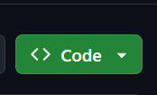
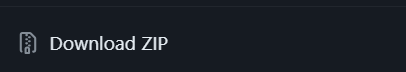
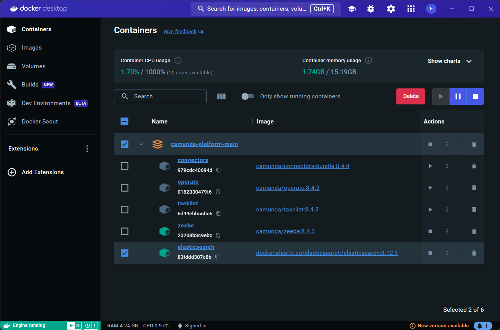

<style>
    h1 a {
        display: none;
    }
    button {
        background-color: transparent;
        padding: 0.5rem 1rem;
        cursor: pointer;
        border: none;
        box-shadow: rgba(0, 0, 0, 0.02) 0px 1px 3px 0px, rgba(27, 31, 35, 0.15) 0px 0px 0px 1px;
    }
     button a {
        text-decoration: none;
        color: black;
    }
</style>
# Setup Camunda 8 self managed Docker image from Github

After downlaoding and insatlling Docker Desktop, you will downlaod and run a Docker image for Camunda, it will include all Camunda's components 

> Docker images are read-only templates that contain instructions for creating a container. A Docker image is a snapshot or blueprint of the libraries and dependencies required inside a container for an application to run.

Camunda's [Github repository](https://github.com/camunda/camunda-platform) includes everything we need to setup our local environment, we will downlaod the whole repo to our machines, <br>

By clicking on the code button <br> 



And then choosing **Download ZIP**



When it  finishes downlaoding, navigate to the downlaod directory, unzip the folder and navigate to the folder **camunda-platform-main** right-click inside file explorer and choose **Open in Terminal**

## Using full package

On your Terminal, if you want to use all Camunda's components, as the full environment contains these components:

* Zeebe
* Operate
* Tasklist
* Connectors
* Optimize
* Identity
* Elasticsearch
* Keycloak
* PostgreSQL

Copy this command and excute it in your terminal 

```
docker compose up -d
```

## Using basic components

If Optimize, Identity, and Keycloak are not needed you can use this one instead

```
docker compose -f docker-compose-core.yaml up -d
```

You should see something like this when the process finishes



&nbsp;

make sure that all the containers are running, you can view each of the application on these ports: 

* Operate: [http://localhost:8081](http://localhost:8081)
* Tasklist: [http://localhost:8082](http://localhost:8082)
* Optimize: [http://localhost:8083](http://localhost:8083)
* Identity: [http://localhost:8084](http://localhost:8084)
* Elasticsearch: [http://localhost:9200](http://localhost:9200)


&nbsp;

&nbsp;
<button><a href="https://emam96.github.io/Camunda_Setup/Docker">Back</a></button>
&nbsp;
&nbsp;
<button><a href="https://emam96.github.io/Camunda_Setup/CamundaImage">Next</a></button>

