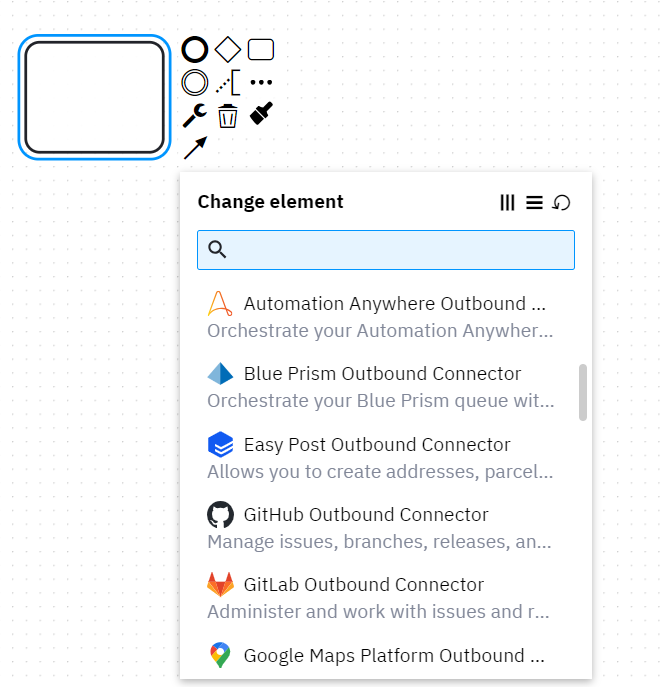

# Add Connectors

> Connectors communicate with any system or technology, reducing the time it takes to automate and orchestrate business processes. Browse Connectors, add them to your BPMN process models in Camunda Modeler, and configure them in Modeler’s intuitive interface.

We can add a ready-to-use connectors package to the web modeler, they differ in use, some of them are built to integrate into a specific product and some are generic implementations of useful libraries. 

We can add them from this [GitHub Repository](https://github.com/camunda/connectors), by downloading the code and pasting the **connectors** folder into the modeler directory at **\resources\element-templates** we will get a list of the template to use in your flows 

&nbsp;

This should cover up the installation process, you can start learning Camunda by going throught their [academy site](https://academy.camunda.com/)

For suggestions or inquiries please reach out to me on [eshararah@avertra.com](eshararah@avertra.com)

&nbsp;

&nbsp;
<button><a href="https://rb.gy/p3bztl">Back</a></button>
