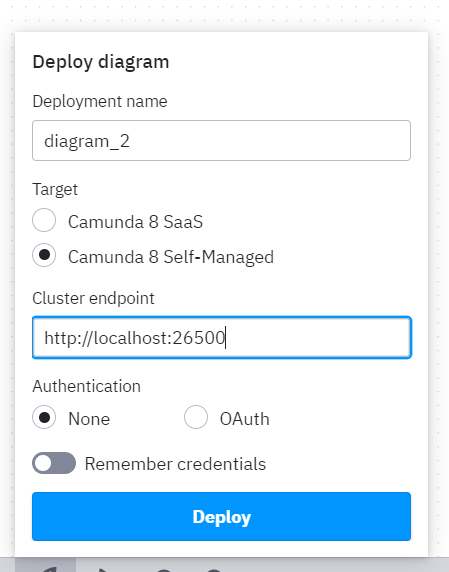

# Download the web modeler

Camunda's web modeler uses BPMN diagrams to visually outline the structure and flow of a process, this is an advantage as it translates the actual flow to an executable logic, which enhances the communication between business and technical staff

We can download the modeler from [here](https://camunda.com/download/modeler/) it's a compressed folder that includes **Camunda Modeler.exe** by clicking on it, you will launch the modeler. 

You can create new BPMN diagrams and DMN diagrams, save it and deploy it to your local setup and run it from the modeler using test data, or re-run them from Operate app. 

You need to connect the modeler to the local setup, it's done by changing the deplyement settings as follow: 

&nbsp;

This way, you will push your work to your running Docker image so you can run and test your processes

&nbsp;

&nbsp;
<button><a href="https://emam96.github.io/Camunda_Setup/CamundaImage">Back</a></button>
&nbsp;
&nbsp;
<button><a href="https://emam96.github.io/Camunda_Setup/CamundaImage">Next</a></button>